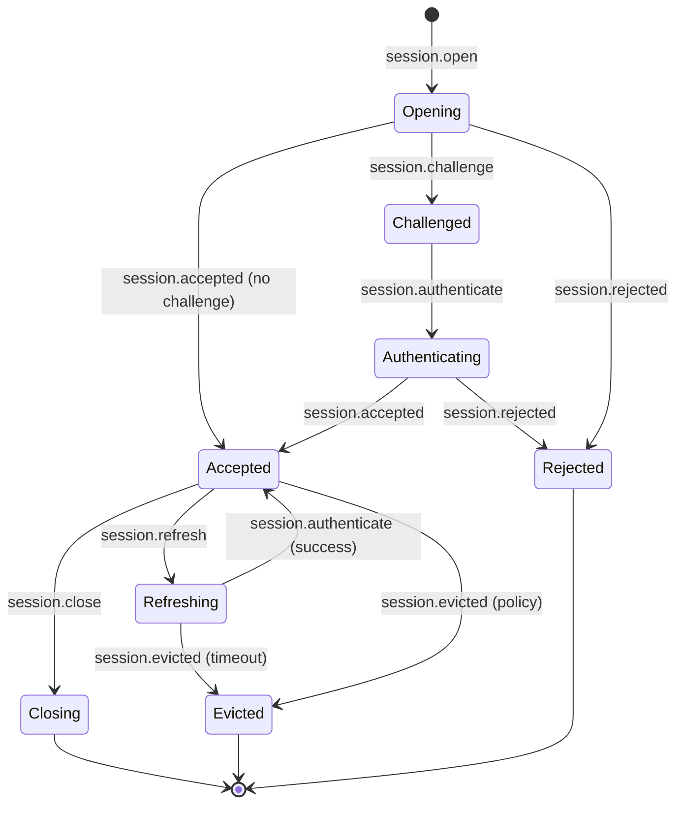
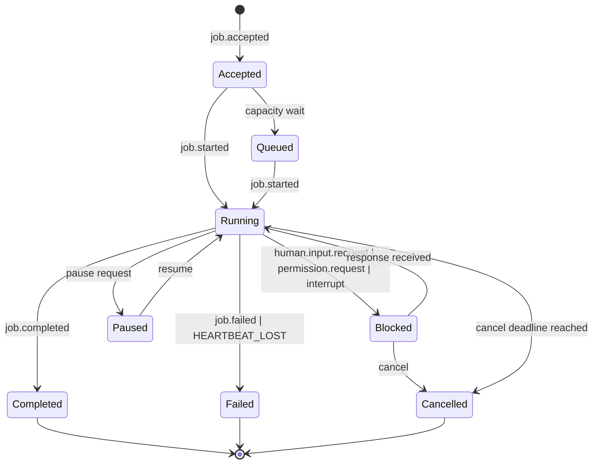
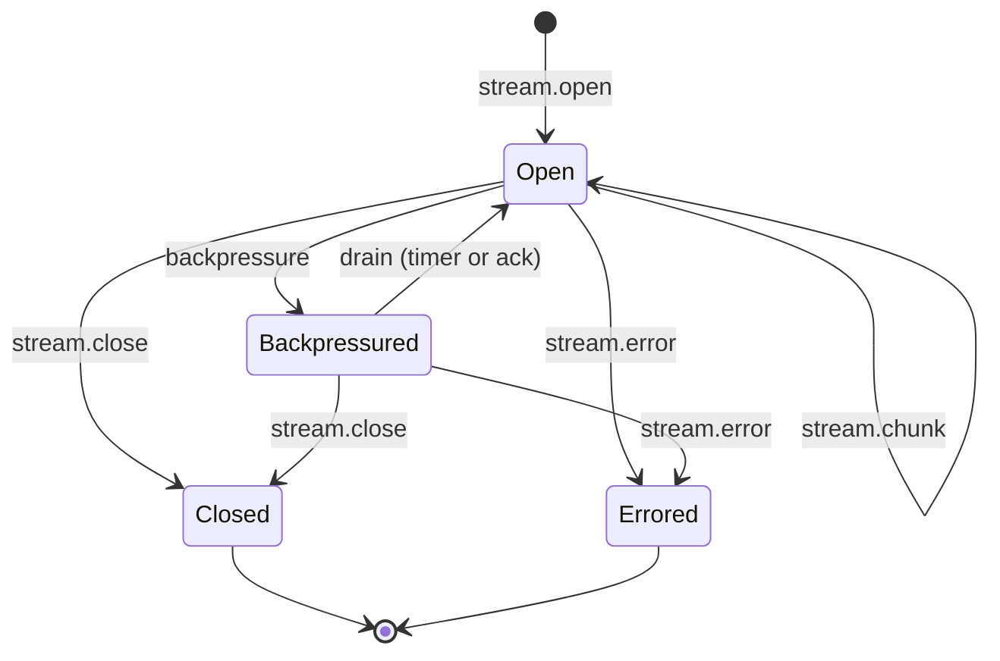
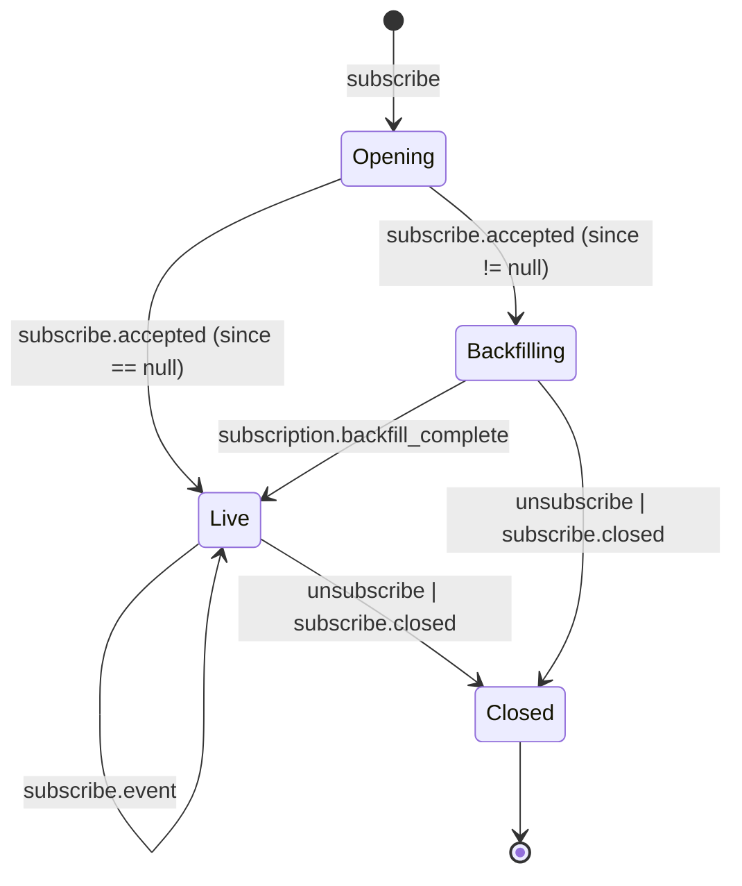
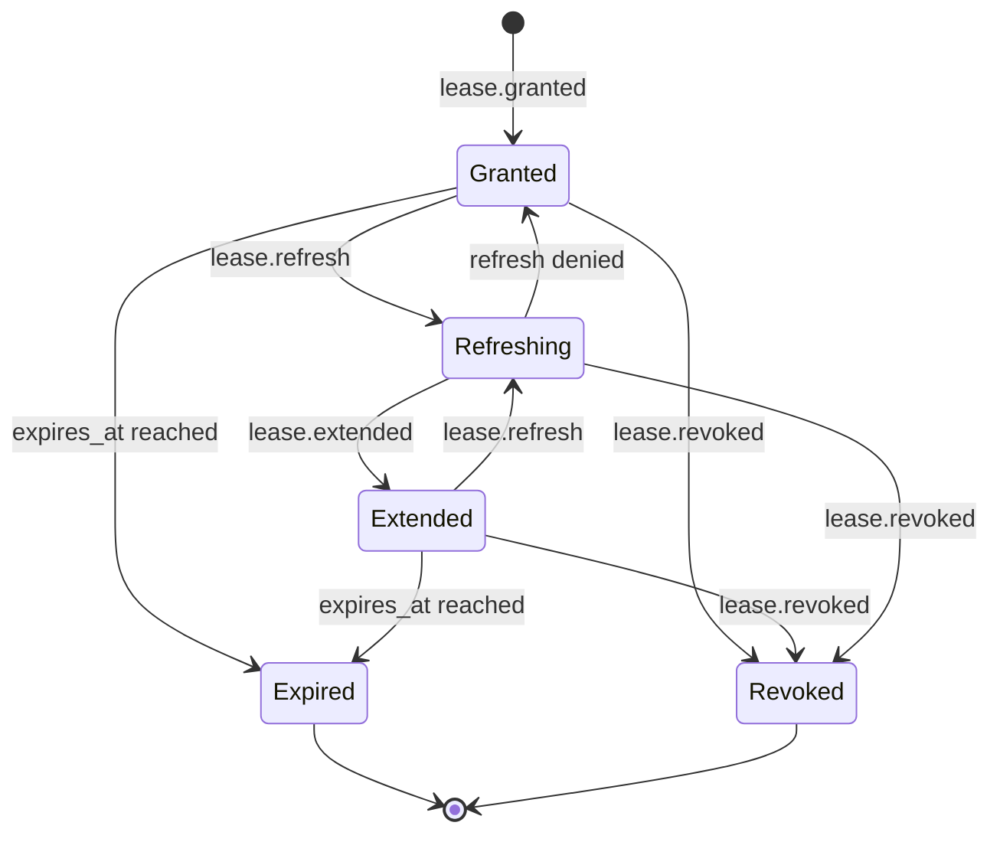

# ARCP TypeScript SDK — Implementation Plan

This document is the implementation plan for the `arcp` Node.js package, a reference TypeScript implementation of the Agent Runtime Control Protocol (ARCP) v1.0 as specified in [`RFC-0001-v2.md`](./RFC-0001-v2.md). It covers RFC interpretation, module mapping, state machines, ambiguities resolved, the integration test plan, and TypeScript-specific design choices that will guide every phase.

---

## 1. RFC Section Summaries (impl-relevant only)

The following per-section notes summarize what each RFC section requires of an implementation. Sections that are non-normative are listed only when they constrain naming.

**§3 Terminology.** Defines the canonical role names — Agent, Runtime, Tool, Session, Stream, Job, Capability, Envelope, Transport, Lease, Subscription, Artifact, Identity, Heartbeat, Extension, Observer. These names propagate into module names, type names, and class names throughout the implementation; we do not invent synonyms.

**§4 Design Principles.** Eight principles that must hold across the codebase: transport-agnostic, streaming-native, durable execution, typed contracts (every message validates against a schema, has an explicit version, and supports negotiation), event-driven, authenticated by default (no traffic before `session.accepted`), and extensible (namespaced extensions, defined unknown-message handling). These read directly into our zod-first schema strategy and the rule that nothing flows on a transport before the handshake completes.

**§5 Architecture.** Three layers (Capability, Runtime, Transport) and three client roles (active, observer, peer). The runtime layer is what we own end-to-end; the capability layer is delegated to MCP and treated as out-of-scope for v0.1 implementation, though we leave hooks open for it. Observer support is realized through subscriptions (§13) and is in scope for v0.1.

**§6.1 Envelope.** Eighteen fields, three required (`arcp`, `id`, `type`, `timestamp` — actually four; `payload` is fifth required). We model the envelope as a zod base shape composed with a discriminated union over `type`, so unknown types fail parsing with a precise error rather than silently degrading to `unknown`. Specifically: `id`, `type`, `arcp`, `timestamp`, `payload` are always required; `session_id`, `job_id`, `stream_id`, `subscription_id` are conditionally required (we encode the conditions per message type via refinements or per-type sub-schemas); `correlation_id`, `causation_id`, `idempotency_key`, `priority`, `extensions`, `source`, `target`, `trace_id`, `span_id`, `parent_span_id` are optional. ULIDs are used for ids (lexically sortable, monotonic with `ulidx`-style guarantees from the `ulid` package's `monotonicFactory`).

**§6.2 Message Types.** Twelve groups of type names (Identity, Control, Execution, Streaming, HITL, Permissions/Leases, Subscriptions, Artifacts, Telemetry). We treat this as the closed vocabulary of `type` values for the discriminated union. Out-of-scope types from §10.6, §14, and the workflow primitives are still listed in the type union but their handlers throw `NotImplementedError` with `code: "UNIMPLEMENTED"`.

**§6.3 Command/Result/Event Flow.** Three patterns: ack-then-events, terminal-event-per-execution, and `nack` for rejection. Implementation: every command registers a `correlation_id` deferred in `runtime/pending.ts`; the terminal event resolves or rejects it; intermediate events accumulate or stream through a side channel.

**§6.4 Delivery Semantics.** At-least-once delivery, dedupe by `id`, distinct logical `idempotency_key`. The event log enforces UNIQUE constraint on `(session_id, id)`. The runtime additionally maintains a `(session_principal, idempotency_key) → outcome` table to short-circuit replays of the same intent across reconnects, persisted to SQLite for at least the lease horizon. Ordering is guaranteed only within a `stream_id`/`job_id`; the SQLite schema uses ULID-ordered ids globally and maintains per-stream sequence numbers in stream metadata.

**§6.5 Priority and QoS.** Four levels (`low`/`normal`/`high`/`critical`). Implementation: a single priority queue per session for outbound message scheduling, with a starvation floor (every 10th selection drops to lowest non-empty queue). `critical` does not bypass; it ranks first but is rate-limited (token bucket per session) when senders abuse it.

**§7 Capability Negotiation.** Boolean and array fields advertised in `session.open` and `session.accepted`. Absent boolean ⇒ `false`. Required-but-unsupported ⇒ `session.rejected` with `code: UNIMPLEMENTED`. We define a `Capabilities` zod schema with all known booleans plus an `extensions: string[]` field; unknown booleans are accepted and forwarded but ignored.

**§8 Authentication & Identity.** Four-step handshake. Auth schemes in scope for v0.1: `bearer`, `signed_jwt`, `none` (only when negotiated). Out: `mtls` (transport-bound, deferred), `oauth2` (introspection requires HTTP, deferred). `signed_jwt` is verified via `jose.jwtVerify` against a JWKS or static key the runtime holds. The handshake driver is a small state machine in `runtime/session.ts`.

**§9 Sessions.** Stateless, stateful, durable. We implement stateless and stateful for v0.1; durable resume across transport reconnects works via `resume` with `after_message_id` only. Checkpoint-based resume is deferred. `session.close` is graceful: open jobs are either cancelled or detached per the closer's request flag.

**§10 Jobs.** Eight states; one terminal state per job. Heartbeats at most every `heartbeat_interval_seconds` (default 30s); two consecutive misses ⇒ `failed` with `HEARTBEAT_LOST` or `blocked` per advertised `heartbeat_recovery`. Cancellation is cooperative, with deadline escalation to hard kill emitting `ABORTED`. Interrupts move the job to `blocked` and emit `human.input.request`. Scheduled jobs (§10.6) are out of scope; `job.schedule` returns `UNIMPLEMENTED`.

**§11 Streams.** Six kinds: `text`, `binary`, `event`, `log`, `metric`, `thought`. v0.1 supports all kinds in declaration; binary uses **base64 in-envelope only** (no sidecar binary frames). Backpressure messages are advisory; senders honor by slowing emission. Reasoning streams (`thought`) carry `role`/`content`/`redacted` per §11.4.

**§12 Human-in-the-Loop.** `human.input.request` carries a JSON-Schema-shaped `response_schema` plus optional `default` and required `expires_at`. Validation on receipt is mandatory; invalid responses ⇒ `nack` with `INVALID_ARGUMENT`. Default policy is first-response-wins; quorum policies are out of scope. Expiration synthesizes the `default` if present, else emits `human.input.cancelled` with `DEADLINE_EXCEEDED`.

**§13 Subscriptions.** Filters AND-ed across fields; arrays inside a field are OR-ed. Subscriptions cannot expose data the subscriber's session is not entitled to (authorized at filter compile, not delivery). `subscribe.event` wraps the original event in `payload.event`. Backfill is replayed from the event log, terminated by a synthetic `subscription.backfill_complete` envelope.

**§15 Permissions and Security.** Permissions are explicit strings; trust levels are categorical. The challenge flow is: detect → emit `permission.request` → block job → grant/deny → resume/fail. Leases are time-bounded materializations of grants; expiry and revocation both result in `PERMISSION_DENIED` failures on use. Trust elevation (§15.6) is deferred.

**§16 Artifacts.** Inline base64 only for v0.1 (`artifact.put` with `payload.data`). `artifact.fetch` returns inline by default; URI redirect is deferred. Retention is a periodic sweep on a `setTimeout(...).unref()` timer.

**§17 Observability.** `log` (six levels), `metric` (with reserved names exported as constants and validated), `trace.span`. Trace context propagation uses `AsyncLocalStorage` so any async code inside a job inherits the right `trace_id`/`span_id`. We do not export to a backend; we just preserve identifiers.

**§18 Error Model.** Twenty-one canonical codes plus `RATE_LIMITED` as alias for `RESOURCE_EXHAUSTED`. We export a frozen `const ERROR_CODES` tuple and derive `type ErrorCode` from it. Every error envelope conforms to a strict zod schema. Retryability defaults are encoded in a small constant table.

**§19 Resumability.** Reconnect with `session_id` + `after_message_id`. Replay from event log up to gap, then live-tail. Retention overflow ⇒ `DATA_LOSS` and let client decide. Checkpoint-based resume deferred.

**§21 Extensions.** Namespacing with `arcpx.<vendor>.<name>.v<n>` or reverse-DNS prefix. Bare `x-` is transport-internal only. Unknown core types ⇒ `UNIMPLEMENTED`. Unknown namespaced types: drop only if `extensions.optional: true`, else `UNIMPLEMENTED`. Receivers MUST NOT crash.

**§22 Transports.** WebSocket and stdio mandatory. We implement both. Reconnection logic (exp backoff + jitter) lives on the client side. stdio is newline-delimited JSON.

---

## 2. Message-Type-to-Module Map

Every message type in §6.2, mapped to the file that owns its zod schema and dispatch logic. Out-of-scope types are still registered (so the discriminator union is exhaustive) but their server handlers throw `NotImplementedError`.

| Group | Type | Module | Status |
|---|---|---|---|
| Identity | `session.open` | `messages/session.ts` | in scope |
| Identity | `session.challenge` | `messages/session.ts` | in scope |
| Identity | `session.authenticate` | `messages/session.ts` | in scope |
| Identity | `session.accepted` | `messages/session.ts` | in scope |
| Identity | `session.unauthenticated` | `messages/session.ts` | in scope |
| Identity | `session.rejected` | `messages/session.ts` | in scope |
| Identity | `session.refresh` | `messages/session.ts` | in scope |
| Identity | `session.evicted` | `messages/session.ts` | in scope |
| Identity | `session.close` | `messages/session.ts` | in scope |
| Control | `ping` / `pong` | `messages/control.ts` | in scope |
| Control | `ack` / `nack` | `messages/control.ts` | in scope |
| Control | `cancel` / `cancel.accepted` / `cancel.refused` | `messages/control.ts` | in scope |
| Control | `interrupt` | `messages/control.ts` | in scope |
| Control | `resume` | `messages/control.ts` | in scope |
| Control | `backpressure` | `messages/control.ts` | in scope |
| Control | `checkpoint.create` / `checkpoint.restore` | `messages/control.ts` | **stub (`UNIMPLEMENTED`)** |
| Execution | `tool.invoke` / `tool.result` / `tool.error` | `messages/execution.ts` | in scope |
| Execution | `job.accepted` / `job.started` / `job.progress` / `job.heartbeat` / `job.checkpoint` / `job.completed` / `job.failed` / `job.cancelled` | `messages/execution.ts` | in scope (checkpoint payload schema accepted; checkpoint engine deferred) |
| Execution | `job.schedule` | `messages/execution.ts` | **stub (`UNIMPLEMENTED`)** |
| Execution | `workflow.start` / `workflow.complete` | `messages/execution.ts` | **stub (`UNIMPLEMENTED`)** |
| Execution | `agent.delegate` / `agent.handoff` | `messages/execution.ts` | **stub (`UNIMPLEMENTED`)** |
| Streaming | `stream.open` / `stream.chunk` / `stream.close` / `stream.error` | `messages/streaming.ts` | in scope |
| HITL | `human.input.request` / `human.input.response` / `human.input.cancelled` | `messages/human.ts` | in scope |
| HITL | `human.choice.request` / `human.choice.response` | `messages/human.ts` | in scope |
| Permissions | `permission.request` / `permission.grant` / `permission.deny` | `messages/permissions.ts` | in scope |
| Permissions | `lease.granted` / `lease.extended` / `lease.revoked` / `lease.refresh` | `messages/permissions.ts` | in scope |
| Subscriptions | `subscribe` / `subscribe.accepted` / `subscribe.event` / `unsubscribe` / `subscribe.closed` | `messages/subscriptions.ts` | in scope |
| Artifacts | `artifact.put` / `artifact.fetch` / `artifact.ref` / `artifact.release` | `messages/artifacts.ts` | in scope |
| Telemetry | `event.emit` / `log` / `metric` / `trace.span` | `messages/telemetry.ts` | in scope |

`messages/index.ts` aggregates all schemas into a single `EnvelopeSchema` discriminated union plus a `MessageRegistry` constant mapping `type → { schema, scope }`. `scope: "core" | "extension"` and `scope: "implemented" | "stub"` flags drive runtime dispatch — stubs return `nack` with `UNIMPLEMENTED` instead of crashing.

---

## 3. State Machines

### 3.1 Session

Implementation: `runtime/session.ts` exports `class SessionState` with `phase: SessionPhase` and a typed `transition(event)` method. Illegal transitions throw `FailedPreconditionError`.

### 3.2 Job

Implementation: `runtime/job.ts` exports `class JobState`. Heartbeat watchdog is a `setTimeout(..., interval * (N+1)).unref()` reset on each `job.heartbeat`. Two timer fires without reset ⇒ transition per `heartbeat_recovery` capability.

### 3.3 Stream

Per-stream sequence numbers monotonic from 0. `StreamWriter.write()` returns a `Promise<void>` that resolves once the consumer signals capacity (default: immediate; backpressured: deferred until next `backpressure` with positive `desired_rate` or a periodic drain check).

### 3.4 Subscription

Implementation: `runtime/subscription.ts` exposes an async iterator. The Backfilling phase reads from the SQLite event log filtered by the compiled filter; the Live phase tails new appends through an in-process pub/sub topic.

### 3.5 Lease

`LeaseManager.use(lease_id)` checks state on every operation; expired/revoked leases throw `LeaseExpiredError` / `LeaseRevokedError` (both extend `PermissionDeniedError` → `ARCPError`).

---

## 4. Open Questions and Chosen Interpretations

The RFC is mostly clear. Where it is silent or genuinely ambiguous, we record the chosen interpretation here so future reviewers can audit it.

1. **Envelope `arcp` version field semantics (§6.1).** RFC says "Protocol version understood by the sender" but does not specify mismatch behavior. **Decision:** the runtime accepts envelopes with `arcp` major equal to its own (`"1.0"` major == `"1"`). Future minor mismatches are accepted. Major mismatch ⇒ `nack` with `UNIMPLEMENTED`. We export `PROTOCOL_VERSION = "1.0"` and a `isCompatibleVersion(v)` helper.

2. **`response_schema` shape in `human.input.request` (§12.1).** RFC shows JSON-Schema in the example but does not formally specify it. **Decision:** the field is typed as `unknown` in the wire schema; the runtime uses `ajv` — wait, we are not adding `ajv` to dependencies. Alternative: we accept JSON-Schema-Draft-7 subset and validate by **re-hydrating into a zod schema** via a small subset compiler in `messages/human.ts`. Supported keywords: `type`, `properties`, `required`, `minLength`, `maxLength`, `minimum`, `maximum`, `enum`, `items`. Unsupported keywords accept any value. We document this restriction in `CONFORMANCE.md`.

3. **`extensions` envelope field as object (§6.1, §21).** RFC shows an object of namespaced fields. **Decision:** we type it as `Record<string, unknown>` and require namespace prefixes on every key; we reject keys without a recognized prefix. The reserved key `extensions.optional: boolean` is hoisted to a typed flag for §21.3 dispatch.

4. **Heartbeat-interval-seconds source (§10.3).** Default is 30 seconds, advertised in capabilities. **Decision:** the `Capabilities` schema includes `heartbeat_interval_seconds?: number` (default 30). Both sides choose the **minimum** of advertised values (more frequent wins) at session-accept time; the chosen value is recorded in `SessionState.heartbeatInterval`.

5. **`capabilities.binary_encoding` (§11.3).** RFC requires this advertisement when any binary streaming is supported. **Decision:** v0.1 advertises `["base64"]` only. Sidecar requests are negotiated down or rejected at capability negotiation.

6. **Subscription delivery to the active client of a session (§13).** Can the actor on a session also be a subscriber? **Decision:** yes — there is no rule against it; the subscription is just additional read-only fanout. The runtime treats `subscribe` from any session uniformly, subject to authorization on filters.

7. **Event log retention default (§19).** Not specified. **Decision:** 24 hours rolling for v0.1, configurable via `ARCPRuntime` constructor option `eventLogRetentionSeconds`. After expiry, replay returns `DATA_LOSS` per spec.

8. **Idempotency-key persistence horizon (§6.4).** "At least the lease horizon" — without a lease, ambiguous. **Decision:** when no lease is in play, we persist `(principal, idempotency_key) → outcome` for `eventLogRetentionSeconds` (24h default). With a lease, max(lease.expires_at, 24h).

9. **Anonymous capability (§4.6, §8.2).** The anonymous flow requires `capabilities.anonymous: true` to be negotiated, but the RFC does not say whether the **client** advertises it in `session.open` or only the **runtime**. **Decision:** both must advertise it; the runtime accepts `none` only when both flags were `true` in negotiation.

10. **`session.refresh` initiation (§8.4).** RFC shows runtime initiating; the client initiating is not addressed. **Decision:** for v0.1, only the runtime initiates; client `session.refresh` is rejected with `FAILED_PRECONDITION`.

11. **Stream kinds vs. dedicated message types (§11.1 vs. §17).** A `stream.chunk` of `kind: log` overlaps semantically with a top-level `log` envelope. **Decision:** both are valid; `log` envelopes are for one-off entries, `stream.chunk` of `kind: log` is for streamed aggregates. The runtime does not coerce one to the other.

12. **Subscription replay ordering (§13.3).** RFC says backfill ⇒ boundary ⇒ live. **Decision:** the boundary is delivered as a synthetic `subscribe.event` whose `payload.event` is `{ type: "event.emit", payload: { name: "subscription.backfill_complete" } }`, exactly matching the RFC wording.

13. **`ack` payload (§6.2).** Not specified. **Decision:** `ack` payload is `{ ack_for: id, received_at: timestamp }` (object, not empty). Symmetrical for `pong`.

14. **`session.evicted` reason taxonomy (§8.5).** Drawn from §18 codes. **Decision:** valid reasons are the subset `{ DEADLINE_EXCEEDED, RESOURCE_EXHAUSTED, UNAUTHENTICATED, ABORTED, FAILED_PRECONDITION }`. Others are rejected at schema parse.

---

## 5. Test Plan (integration)

Every integration test is named, located, and described here. Unit tests are co-located by module and not enumerated. Each test asserts a specific protocol surface and a specific RFC section. All run against `transport/memory.ts` first; in Phase 6 they parameterize across `[memory, websocket, stdio]` via `describe.each`.

| Test file | Scenario | Asserts § |
|---|---|---|
| `test/integration/handshake.test.ts` | Bearer auth, no challenge happy path; bearer rejected; signed_jwt accepted; signed_jwt expired ⇒ rejected; anonymous accepted iff negotiated; pre-handshake message dropped; replayed `session.open` id rejected. | §8.1, §8.2, §4.6 |
| `test/integration/job-lifecycle.test.ts` | `tool.invoke` ⇒ `job.accepted` ⇒ `job.started` ⇒ N×`job.progress` ⇒ `job.completed`; failed path with retry-eligible code; heartbeats received at expected cadence; missed heartbeats ⇒ `HEARTBEAT_LOST` (`heartbeat_recovery: fail`); missed heartbeats ⇒ `blocked` (`heartbeat_recovery: block`). Uses `vi.useFakeTimers()`. | §10.1, §10.2, §10.3 |
| `test/integration/cancellation.test.ts` | Cooperative cancel within deadline ⇒ `cancel.accepted` + `job.cancelled`; cancel of already-terminal job ⇒ `cancel.refused (already_terminal)`; cancel exceeds deadline ⇒ hard kill with `ABORTED`; stream cancel emits `stream.error` with `code: CANCELLED`. | §10.4 |
| `test/integration/interrupt.test.ts` | `interrupt` on running job ⇒ job to `blocked` + `human.input.request`; response resumes job; `interrupt` on non-interrupt-capable runtime ⇒ falls back to cancel. | §10.5 |
| `test/integration/human-input.test.ts` | input request with `response_schema`; valid response succeeds and unblocks job; invalid response ⇒ `nack INVALID_ARGUMENT`; expiration with `default` ⇒ synthesized response; expiration without default ⇒ `human.input.cancelled DEADLINE_EXCEEDED`; choice request basic flow. | §12.1, §12.2, §12.4 |
| `test/integration/permission-lease.test.ts` | Permission challenge ⇒ blocked ⇒ grant ⇒ resumed; deny ⇒ `PERMISSION_DENIED`; lease use happy path; lease expiry ⇒ `LEASE_EXPIRED`; lease revoke ⇒ `LEASE_REVOKED`; lease refresh extends. | §15.4, §15.5 |
| `test/integration/subscription.test.ts` | Subscribe by `session_id` returns events; `types` filter narrows; `min_priority` filter; backfill ⇒ `subscription.backfill_complete` boundary ⇒ live tail with no gap; unauthorized filter rejected with `PERMISSION_DENIED`; observer-only client cannot send commands. | §13 |
| `test/integration/artifact.test.ts` | `artifact.put` inline; `artifact.fetch` by id; `artifact.fetch` after `artifact.release` ⇒ `NOT_FOUND`; retention sweep removes expired artifacts; `tool.result.payload.result_ref` references an artifact that fetches successfully. | §16 |
| `test/integration/resume.test.ts` | Disconnect mid-job; reconnect with same `session_id` and `after_message_id`; replay returns same canonical stream; resume requesting message older than retention ⇒ `DATA_LOSS`; survives child-process kill (using `node:child_process`). | §19 |
| `test/integration/extension-unknown.test.ts` | Unknown core type ⇒ `nack UNIMPLEMENTED`; unknown namespaced type with `extensions.optional: true` ⇒ silent drop (no nack); unknown namespaced type without optional ⇒ `nack UNIMPLEMENTED`; valid registered extension dispatches correctly; runtime never crashes on unknown messages. | §21 |
| `test/e2e/relay-scenario.test.ts` | Full lifecycle: runtime + agent client + observer subscriber; tool invoke; reasoning stream; permission challenge → grant; human input → response; artifact produced; observer sees ordered fan-out; runtime shuts down cleanly. | §23 |

Unit tests cover: envelope round-trips per type, error-code tuple coverage, extension namespace validation, event-log dedup and replay ordering, pending-request registry timeouts and cancellation, capability merge logic, JSON-Schema-subset response validation, JWT verification edge cases, ULID monotonicity under fast clock skew.

---

## 6. TypeScript Design Choices

These are the strategic decisions that should not be re-litigated phase by phase.

**Zod as runtime contract.** Every wire message is a zod schema. Type aliases come from `z.infer<typeof X>`. The envelope is `z.discriminatedUnion("type", [...])`. Parsing returns either a typed object or a `ZodError` we wrap into `ARCPError` at the dispatch boundary. We do not write our own validators — zod is the only source of validation truth.

**Strict tsconfig.** The `tsconfig.json` enables every relevant strict flag including `noUncheckedIndexedAccess`, `exactOptionalPropertyTypes`, `verbatimModuleSyntax`. The `exactOptionalPropertyTypes` flag means we cannot set optional fields to `undefined`; we use `.transform(stripUndefined)` on zod parsers and structure object literals so optional fields are omitted, not set to `undefined`. Wire schemas use `.optional()` then `.transform()` to preserve this invariant.

**No `any`, no `as`, no `!`.** Biome enforces `noExplicitAny`, `noNonNullAssertion`. The only narrowing tool is `unknown → zod.parse()`. Type assertions appear only at the transport-receive boundary in `transport/base.ts` (`unknown` → JSON → zod parse) and in the extension registry where the payload is validated by a registered extension schema before hand-off.

**Async iterators for streams and subscriptions.** Both `StreamReader` and `SubscriptionFeed` implement `AsyncIterableIterator<T>`. The async iterator contract handles backpressure naturally — slow consumers create natural backpressure on awaited writes. We do **not** use Node's `EventEmitter` for protocol surfaces; we have a tiny typed `Topic<T>` helper for in-process fanout when async iterators are insufficient.

**AbortSignal everywhere.** Cancellation propagates via `AbortSignal`. We provide `combineSignals(...signals: AbortSignal[]): AbortSignal` in `util/abort.ts`. Heartbeat watchdog timers and pending-request deadlines integrate with `AbortSignal.timeout()` (Node 22+).

**`AsyncLocalStorage` for trace context.** `trace.ts` exports `withSpan(span, fn)` and `currentSpan()`. Every job execution wraps user code in `withSpan` so any nested awaits inherit the right `trace_id`/`span_id` without explicit plumbing. This also lets envelope-emission helpers auto-fill `trace_id`/`span_id` from context.

**ULIDs for ids.** Monotonic ULIDs from the `ulid` package via `monotonicFactory()`. Lexically sortable; SQLite indexes on them are well-behaved. `Date.now()` is never used for ordering or correlation, only for human-readable `timestamp` fields (RFC 3339 via `new Date().toISOString()`).

**Pending request registry as the bidirectional spine.** `runtime/pending.ts` owns a `Map<string, Deferred<T>>` keyed by `correlation_id`. Every command that expects a response (`permission.request`, `human.input.request`, `human.choice.request`, `lease.refresh`, even `cancel`) registers a deferred. The corresponding response message resolves it. Deadlines drive automatic rejection; the abort wraps cleanly.

**SQLite event log via `better-sqlite3` with async facade.** `better-sqlite3` is synchronous — that is the right tool for an embedded event log because each operation is microseconds and serial. We wrap it in an async facade (`async append(env)`) so callers do not couple to the sync API. We avoid worker threads for v0.1 because they add complexity without benefit at our throughput target.

**Pino for logs, with child loggers per session.** A single root logger; `runtime/server.ts` creates a child logger per session bound to `session_id`, `principal`, `runtime`. CLI uses `process.stdout.write` for user-visible output and pino for diagnostics. No `console.log` in package code.

**ESM + NodeNext + verbatim module syntax.** All imports use explicit `.js` extensions on relative imports (per Node ESM resolution). Type-only imports use `import type` or `import { type X }`. We do not use `__dirname`/`__filename`; we use `import.meta.url` + `node:url.fileURLToPath()` when filesystem paths are needed (mostly for the SQL schema file).

**Module structure for parallelism.** Phase 3 parallelizes `runtime/job.ts`, `runtime/stream.ts`, and the cancellation logic by fixing their interface contracts in Phase 2. Phase 5 parallelizes `runtime/subscription.ts` and `runtime/artifact.ts` similarly.

**Examples are real.** Every example in `examples/` opens an in-process runtime, runs against it, and exits 0. We use `tsx` to run TypeScript directly in dev. CI runs every example as a smoke test.

**Test isolation.** Every integration test creates its own `ARCPRuntime` instance with no shared state — `:memory:` SQLite, ephemeral ports for WS, fresh in-process transports. Tests run in parallel by default.

---

## 7. Phase-by-Phase Entry Conditions

| Phase | Entry condition |
|---|---|
| 0 | None. Ends at this PLAN.md being committed. |
| 1 | Phase 0 commit. Repo skeleton runnable. |
| 2 | Phase 1 commit; envelope + errors + event log + extensions tested. |
| 3 | Phase 2 commit; handshake tested over memory transport. |
| 4 | Phase 3 commit; jobs and streams green under fake timers and 50× repeat. |
| 5 | Phase 4 commit; HITL and permission/lease integration tests green. |
| 6 | Phase 5 commit; subscriptions, artifacts, resume integration tests green. |
| 7 | Phase 6 commit; full integration suite green over WS and stdio. |
| Done | Phase 7 commit; all DoD criteria true. |

---

## 8. Notes on Deviations and Risks

- **`exactOptionalPropertyTypes` × zod**: we will likely hit `T | undefined` mismatches when constructing envelopes from optional fields. Mitigation: a `pickDefined()` helper that strips `undefined` keys before calling `EnvelopeSchema.parse()`. Unit-tested against round-trips.
- **`better-sqlite3` native build**: requires a working C++ toolchain. CI must include `pnpm install` ahead of any test job, and contributors on Apple Silicon need `xcode-select --install`. Documented in README.
- **WebSocket sidecar binary frames** (out of scope): the type union still includes `kind: binary` streams; client code that passes binary will receive base64 results back. We document the limitation and throw a typed error if a sidecar frame is received unexpectedly.
- **Subscription authorization**: the RFC requires authorization at filter compile (§13.2). Our minimal model: every session has a `principal` and an `entitlements: { sessions: string[]; traces: string[] }`. Filters that reference IDs outside the entitlement set are rejected. v0.1 entitlements are populated coarsely: a session can subscribe to its own session id and any trace id originated by it. Multi-tenant authorization is left for v0.2.
- **JWT verification**: we use `jose` and require runtime construction with either a static key (for tests) or a JWKS URL (for production). The JWKS fetch is done lazily and cached.
- **Trace context across transports**: our trace context lives in process; transports do not propagate `AsyncLocalStorage` across the wire. The `trace_id`/`span_id` fields on the envelope **do** propagate, and the receiver re-establishes context using `withSpan()` before dispatching the message.

---

## 9. What "Done" Means for Phase 0

Gate 0 passes when:
- This PLAN.md exists and is substantive.
- `package.json` declares ESM, Node ≥22, the dependencies listed in §1, and the scripts `typecheck`, `lint`, `test`, `build`.
- `tsconfig.json` and `tsconfig.build.json` enforce the strict flags above.
- `biome.json` enforces `noExplicitAny`, `noNonNullAssertion`, `useImportType`, `useNodejsImportProtocol`, `noConsole` (with `error` allowance for CLI/examples), and import organization.
- `vitest.config.ts` configures `node` environment, coverage thresholds at 85%, and `passWithNoTests`.
- `simple-git-hooks` runs `pnpm lint && pnpm test` on commit.
- `pnpm install`, `pnpm typecheck`, `pnpm lint`, `pnpm test` all exit 0.
- `RFC-0001-v2.md` lives in the package root.
- The repo is committed as `phase 0: scaffolding and PLAN`.

Once that holds, Phase 1 begins.
