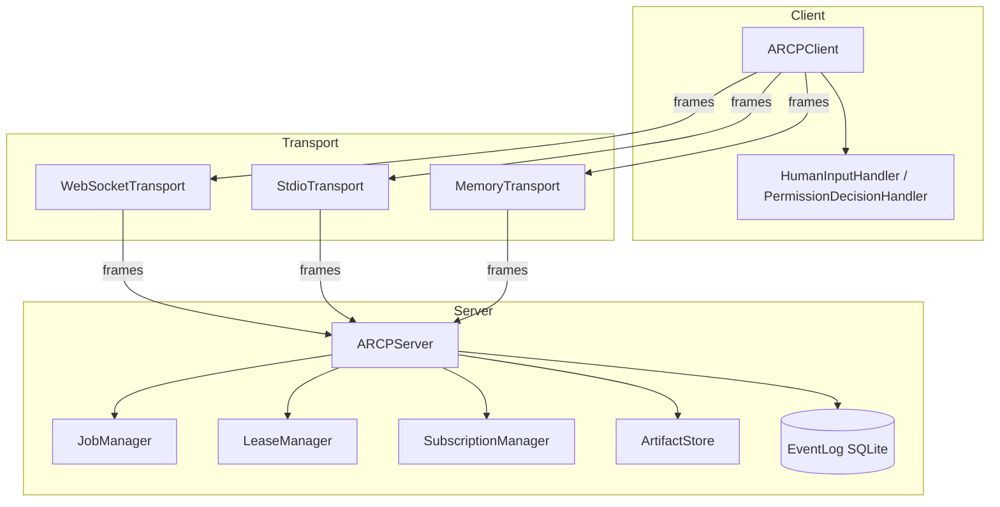

# `arcp` — Agent Runtime Control Protocol (TypeScript reference)

Reference implementation of [RFC 0001 v2 — Agent Runtime Control
Protocol](./RFC-0001-v2.md), targeting Node.js 22 LTS or newer.

This is the **v0.1** cut: comprehensive on protocol fundamentals (envelope,
sessions, jobs, streams, human-in-the-loop, permissions, leases,
subscriptions, artifacts, resume, error model, extensions) and deliberately
deferred on the rest. See [CONFORMANCE.md](./CONFORMANCE.md) for a
section-by-section status.

## Quickstart

```sh
pnpm install
pnpm typecheck
pnpm test
pnpm tsx examples/01-minimal-session.ts
```

That last command runs an in-process runtime + client over a memory transport
and prints a freshly-minted `session_id`.

To talk over a real socket:

```sh
# Terminal A
pnpm tsx src/cli.ts serve --transport ws --host 127.0.0.1 --port 7777 \
  --token mytoken --principal me@example.com

# Terminal B
pnpm tsx src/cli.ts send --url ws://127.0.0.1:7777 --token mytoken \
  --type tool.invoke --payload '{"tool":"ping","arguments":{"hello":"world"}}'
```

## Architecture



Three layers, all ESM, all strictly typed:

| Layer | Modules | RFC |
|---|---|---|
| Capability | `messages/` (zod schemas) | §6.2, §7 |
| Runtime | `runtime/` (state machines, dispatch) | §8–§19 |
| Transport | `transport/` (memory, stdio, ws) | §22 |

## Examples

Six runnable scripts under [`examples/`](./examples/). Each spins up an
in-process runtime + client and exits cleanly.

| Script | Demonstrates |
|---|---|
| [`01-minimal-session.ts`](examples/01-minimal-session.ts) | Bearer auth + four-message handshake (§8.1). |
| [`02-tool-invoke-with-progress.ts`](examples/02-tool-invoke-with-progress.ts) | Tool registration, progress events, log stream (§10, §11). |
| [`03-human-input-request.ts`](examples/03-human-input-request.ts) | `human.input.request` round-trip with schema validation (§12.1). |
| [`04-permission-challenge.ts`](examples/04-permission-challenge.ts) | Permission challenge → grant → lease (§15.4). |
| [`05-observer-subscription.ts`](examples/05-observer-subscription.ts) | `subscribe` with `types` filter, async iteration (§13). |
| [`06-relay-human-in-the-loop.ts`](examples/06-relay-human-in-the-loop.ts) | Artifacts + HITL combined (§12 + §16). |

## Public API surface

```ts
import {
  // Identity & connection
  ARCPClient, ARCPServer, pairMemoryTransports, StdioTransport,
  WebSocketTransport, startWebSocketServer,
  // Auth
  StaticBearerVerifier, JwtVerifier,
  // Tooling
  type JobContext, type ToolHandler,
  // HITL
  type HumanInputHandler, type PermissionDecisionHandler,
  // Errors
  ARCPError, type ErrorCode, ERROR_CODES,
  // Diagnostics
  rootLogger, silentLogger,
} from "arcp";
```

Subpath imports also work: `arcp/runtime`, `arcp/client`, `arcp/transport`,
`arcp/messages`, `arcp/errors`.

## Project layout

```
src/
  envelope.ts         Envelope schema + factories (§6.1)
  errors.ts           Canonical taxonomy + ARCPError class (§18)
  extensions.ts       Namespace validation + registry (§21)
  messages/           Per-type zod schemas (§6.2)
  runtime/            Server, jobs, streams, leases, subscriptions, artifacts
  client/             Client + handlers
  transport/          Memory / stdio / WebSocket
  store/              SQLite event log
  auth/               Bearer + JWT verifiers
  util/               Deferred, ULIDs, abort, timers, JSON-Schema subset
  cli.ts              `arcp` CLI
test/
  unit/               Per-module unit tests
  integration/        End-to-end protocol tests across transports
  e2e/                Relay scenario
examples/             Six runnable demos
```

## Development

```sh
pnpm typecheck   # tsc --noEmit
pnpm lint        # biome check .
pnpm test        # vitest run
pnpm test:coverage
pnpm build       # emits dist/
```

## RFC mapping at a glance

The complete RFC ships in this package as [`RFC-0001-v2.md`](./RFC-0001-v2.md);
section-by-section status is in [`CONFORMANCE.md`](./CONFORMANCE.md). Key
decisions and ambiguities resolved are documented in [`PLAN.md`](./PLAN.md).
