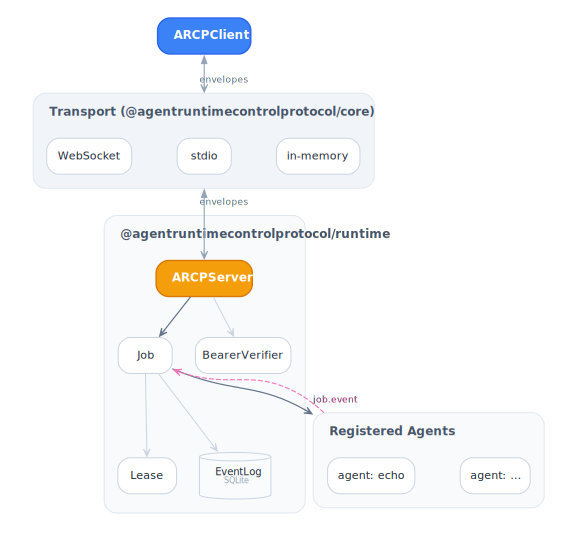

# ARCP TypeScript SDK documentation

Reference docs for the [ARCP](https://github.com/agentruntimecontrolprotocol/spec/blob/main/docs/draft-arcp-1.1.md) TypeScript
SDK. The [top-level README](../README.md) is the front door — these pages
go deeper into each subsystem.

<picture>
  <source media="(prefers-color-scheme: dark)" srcset="../diagrams/architecture-dark.svg">
  
</picture>

## Start here

- [Getting started](./getting-started.md) — install, build a runtime + client, run the example.
- [Architecture](./architecture.md) — how `@agentruntimecontrolprotocol/core`, `@agentruntimecontrolprotocol/client`, and `@agentruntimecontrolprotocol/runtime` fit together.
- [Transports](./transports.md) — WebSocket, stdio, in-memory; when to pick each.
- [CLI](./cli.md) — the `arcp` binary shipped by `@agentruntimecontrolprotocol/sdk`.
- [Effect-native surface](./effect.md) — Layers, Services, and ManagedRuntime for Effect-shaped callers.

## Guides (one per spec section)

| Page                                               | Spec |
| -------------------------------------------------- | ---- |
| [Sessions](./guides/sessions.md)                   | §6   |
| [Resume](./guides/resume.md)                       | §6.3 |
| [Authentication](./guides/auth.md)                 | §6.1 |
| [Jobs](./guides/jobs.md)                           | §7   |
| [Job events](./guides/job-events.md)               | §8   |
| [Leases](./guides/leases.md)                       | §9   |
| [Credentials](./guides/credentials.md)             | §9.7–§9.8 |
| [Delegation](./guides/delegation.md)               | §10  |
| [Observability](./guides/observability.md)         | §11  |
| [Errors](./guides/errors.md)                       | §12  |
| [Vendor extensions](./guides/vendor-extensions.md) | §15  |

## Packages

| Package                 | Page                                                      |
| ----------------------- | --------------------------------------------------------- |
| `@agentruntimecontrolprotocol/sdk`             | [packages/sdk](./packages/sdk.md)                         |
| `@agentruntimecontrolprotocol/core`            | [packages/core](./packages/core.md)                       |
| `@agentruntimecontrolprotocol/client`          | [packages/client](./packages/client.md)                   |
| `@agentruntimecontrolprotocol/runtime`         | [packages/runtime](./packages/runtime.md)                 |
| `@agentruntimecontrolprotocol/node`            | [packages/node](./packages/node.md)                       |
| `@agentruntimecontrolprotocol/express`         | [packages/express](./packages/express.md)                 |
| `@agentruntimecontrolprotocol/fastify`         | [packages/fastify](./packages/fastify.md)                 |
| `@agentruntimecontrolprotocol/hono`            | [packages/hono](./packages/hono.md)                       |
| `@agentruntimecontrolprotocol/bun`             | [packages/bun](./packages/bun.md)                         |
| `@agentruntimecontrolprotocol/middleware-otel` | [packages/middleware-otel](./packages/middleware-otel.md) |

## Reference

- [Recipes](./recipes.md) — copy-paste solutions to common problems.
- [Conformance](./conformance.md) — spec coverage by section.
- [Troubleshooting](./troubleshooting.md) — error codes and fixes.

## Diagrams

The hero diagram above is generated from Graphviz. The source files and
authoring guide live in [`../diagrams/`](../diagrams/) — light/dark
variants render through GitHub's `<picture>` element with
`prefers-color-scheme`.
