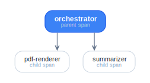

# Delegation (§10)

An agent can spawn a child job from inside its handler. The child runs
under a fresh `job_id` with its own lease (a subset of the parent's),
inherits the parent's `trace_id` for observability, and lives as a
first-class job — the client can observe its events and final result
just like any other.

## Why one verb

Delegation is not a separate protocol message. The parent agent emits
a `job.event` of kind `delegate`; the runtime intercepts that event,
validates the request, and issues a fresh `job.accepted` for the
child. This keeps the wire surface minimal — clients that don't care
about delegation just see two job streams.

## Parent side

```ts
server.registerAgent("orchestrator", async (input, ctx) => {
  await ctx.delegate({
    delegate_id: "render-pdf", // local correlation id
    agent: "pdf-renderer",
    input: { source: input.markdown },
    lease_request: {
      "net.fetch": ["s3://artifacts/**"],
    },
  });

  // …more work…
  return { ok: true };
});
```

`ctx.delegate()` returns when the runtime has emitted the `delegate`
event. The actual child job runs asynchronously. To wait for it,
listen for the child's events or final result on the session.

## Child agent

Looks identical to any other agent. It receives `input` and a
`JobContext`. The runtime sets two extra fields on the child's `Job`:

- `parentJobId` — the parent's `job_id`.
- `delegateId` — the local correlation id supplied in `delegate.body`.

The child inherits the parent's `trace_id` if present.

```ts
server.registerAgent("pdf-renderer", async (input, ctx) => {
  await ctx.status("rendering");
  const url = await render(input.source);
  await ctx.artifactRef({
    uri: url,
    content_type: "application/pdf",
  });
  return { url };
});
```

## Subset validation

The child's `lease_request` MUST be a subset of the parent's
**effective** lease (the one returned on `job.accepted`, possibly
narrower than what the parent asked for).

```ts
// Parent's effective lease
const parent = {
  "net.fetch": ["s3://artifacts/**", "https://api.example.com/**"],
  "tool.call": ["render.*"],
};

// Allowed child:
{ "net.fetch": ["s3://artifacts/2026/**"], "tool.call": ["render.pdf"] }

// REJECTED child (broader fetch scope):
{ "net.fetch": ["s3://**"] }

// REJECTED child (introduces new capability):
{ "fs.write": ["/tmp/**"] }
```

The runtime uses `assertLeaseSubset(child, parent)` and, on
violation, surfaces a `tool_result` event on the **parent** with
`error.code: "LEASE_SUBSET_VIOLATION"`. Crucially, this is **not** a
session-level error — the parent decides whether to recover.

## Client side

Children appear as ordinary jobs on the same session:

```ts
const handle = await client.submit({ agent: "orchestrator", input: {} });

client.on("job.accepted", (env) => {
  if (env.type !== "job.accepted") return;
  const { job_id, parent_job_id, delegate_id } = env.payload;
  if (parent_job_id) {
    console.log(`child ${job_id} (delegate_id=${delegate_id})`);
  }
});

client.on("job.event", (env) => {
  // Events from both parent and child arrive here; differentiate by job_id.
});

await handle.done; // resolves on parent's terminal event
```

The parent's `done` resolves on the **parent's** terminal envelope.
Children may outlive the parent (the spec doesn't forbid this); your
agent code is responsible for awaiting children if that's the
semantic you want.

## Trace propagation

Children inherit `trace_id`. With
[`@agentruntimecontrolprotocol/middleware-otel`](../packages/middleware-otel.md) on both
sides, every child job becomes a child span of the parent — your
observability stack reconstructs the orchestration tree
automatically.

<picture>
  <source media="(prefers-color-scheme: dark)" srcset="../../diagrams/delegation-span-tree-dark.svg">
  
</picture>

## Cancellation cascade

`cancelJob(parentId)` cancels the parent. The parent's
`AbortController.signal` fires inside the agent; if the agent doesn't
abort its children, they keep running. Convention is to track child
handles and cancel them in a `try`/`finally`:

```ts
server.registerAgent("orchestrator", async (input, ctx) => {
  const children = new Set<JobId>();
  try {
    await ctx.delegate({
      /* … */
    });
    // …
  } finally {
    if (ctx.signal.aborted) {
      // emit cancel intents for children — they're separate jobs
      for (const id of children)
        await ctx.toolCall({
          tool: "x-vendor.acme.cancel",
          call_id: id,
          args: { job_id: id, reason: "parent-cancelled" },
        });
    }
  }
});
```

A future ARCP revision may formalize cascade semantics. For v1.1
it's an application convention.

## Idempotency

Children may carry their own `idempotency_key` in the delegate body,
treated identically to top-level submission keys:

```ts
await ctx.delegate({
  delegate_id: "summary",
  agent: "summarize",
  input: { source: doc },
  lease_request: { "tool.call": ["summarize"] },
  idempotency_key: `summary-${docHash}`,
});
```

The runtime's `(principal, idempotency_key)` cache spans top-level
submits and delegations — a duplicate key from any path collapses to
the same job.

## Runnable example

[`examples/delegate/`](../../examples/delegate/) — orchestrator
spawns two children, one of which violates the subset rule and
surfaces as a `tool_result.error` on the parent.
