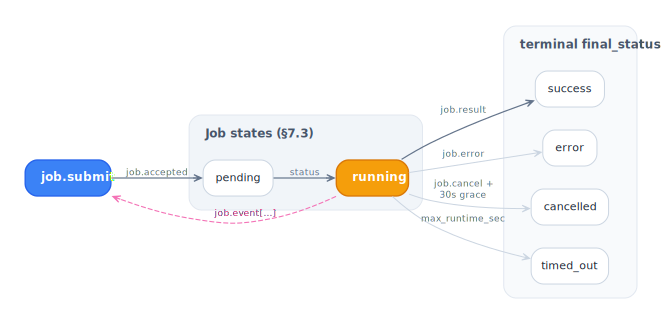

# Jobs (§7)

A job is one invocation of one registered agent. One verb to start
(`job.submit`), one verb to stop (`job.cancel`), and a terminal
`job.result` or `job.error` to end. Everything in between flows as
`job.event` (see [job-events.md](./job-events.md)).

<picture>
  <source media="(prefers-color-scheme: dark)" srcset="../../diagrams/job-lifecycle-dark.svg">
  
</picture>

## States (§7.3)

```
pending → running → success
                 ↘ error
                 ↘ cancelled
                 ↘ timed_out
```

`final_status` is on the terminal event, not a separate verb. Once
terminal, the job is done — no more envelopes carry that `job_id`.

## Client side

```ts
const handle = await client.submit({
  agent: "weekly-report",
  input: { week: "2026-W19" },
  lease: { "net.fetch": ["s3://example/**"] },
  idempotencyKey: "weekly-report-2026-W19",
  maxRuntimeSec: 600,
});

console.log("job_id:", handle.jobId);
console.log("lease:", handle.lease);

client.on("job.event", (env) => {
  if (env.job_id !== handle.jobId) return;
  console.log(`[${env.event_seq}] ${env.payload.kind}`, env.payload.body);
});

const result = await handle.done;
// → { final_status: "success", result?, summary? }
//   or throws an ARCPError on terminal job.error
```

`client.submit()` is asynchronous because it round-trips with
`job.accepted` before returning the handle. `handle.done` is a promise
that resolves on `job.result` or rejects on `job.error`.

## Runtime side

Agents are functions registered by name:

```ts
server.registerAgent("weekly-report", async (input, ctx) => {
  await ctx.status("running");
  await ctx.log("info", "starting", { week: input.week });

  for (const url of input.urls) {
    // lease enforcement is automatic — toolCall checks the lease
    await ctx.toolCall({ tool: "fetch", args: { url }, call_id: url });
    // …work…
    await ctx.toolResult({ call_id: url, result: { ok: true } });
  }

  return { ok: true, summary: `processed ${input.urls.length} urls` };
});
```

Returning normally produces `job.result`. Throwing an `ARCPError`
produces `job.error` with that code. Throwing anything else produces
`job.error { code: "INTERNAL_ERROR" }` and is logged on the runtime.

## `SubmitOptions`

| Field | Notes |
| --- | --- |
| `agent: string` | Required. Must match a registered name. |
| `input?: unknown` | Free-form payload, encoded per `capabilities.encodings`. |
| `lease?: Lease` | Capability grant. Runtime MAY reduce, MUST NOT expand (§9). |
| `idempotencyKey?: string` | (§7.2) — collapses retries. |
| `maxRuntimeSec?: number` | Hard wall clock; trips `TIMEOUT`. |
| `traceId?: TraceId` | 32-hex W3C trace id to propagate. |
| `signal?: AbortSignal` | Client-side cancellation; sends `job.cancel` on abort. |
| `leaseConstraints?: LeaseConstraints` | v1.1 (§9.5/§9.6) — expiration + budgets. |

## Idempotency (§7.2)

```ts
const handle1 = await client.submit({
  agent: "weekly-report",
  input: { week: "2026-W19" },
  idempotencyKey: "weekly-report-2026-W19",
});

// Some time later, after a crash + restart:
const handle2 = await client.submit({
  agent: "weekly-report",
  input: { week: "2026-W19" },
  idempotencyKey: "weekly-report-2026-W19",
});

handle1.jobId === handle2.jobId; // true (same job)
```

The runtime caches `(principal, idempotency_key) → job_id` for
`idempotencyTtlMs` (default 24h). A duplicate submit returns the
existing job's `job.accepted` and replays events from `event_seq = 0`,
so the client recovers full state.

Pair with [resume](./resume.md) for full crash-recovery.

## Cancellation (§7.4)

One path, one verb:

```ts
await client.cancelJob(handle.jobId, { reason: "user-cancelled" });
```

The runtime:

1. Sends `SIGINT`-equivalent via the job's `AbortController` —
   `ctx.signal` fires inside the agent.
2. Waits `cancelGraceMs` (default 30s) for the agent to terminate
   cooperatively.
3. If still running, forcibly transitions the job to `cancelled` and
   emits the terminal envelope.

Inside the agent:

```ts
server.registerAgent("longrunning", async (input, ctx) => {
  while (await keepGoing()) {
    if (ctx.signal.aborted) {
      await ctx.log("info", "cancelled cooperatively");
      throw new CancelledError("user-cancelled");
    }
    await work();
  }
  return { ok: true };
});
```

You can also pass an `AbortSignal` to `submit` so the client side
cancels on signal abort:

```ts
const ac = new AbortController();
setTimeout(() => ac.abort(), 5000);

const handle = await client.submit({
  agent: "longrunning",
  input: {},
  signal: ac.signal,
});
```

## Timeouts

`maxRuntimeSec` sets a hard wall clock. When it trips:

- `ctx.signal` fires (same as cancel).
- The runtime emits `job.error { final_status: "timed_out", code: "TIMEOUT" }`.

There is no separate "soft" timeout — agents that need a grace period
should compute remaining budget themselves and emit a final
`tool_result` before the wall clock expires.

## Cost budgets (v1.1, §9.6)

When the `lease_constraints` feature is negotiated, the lease can
carry per-currency budgets:

```ts
const handle = await client.submit({
  agent: "research",
  input: { query: "…" },
  lease: { "net.fetch": ["https://**"] },
  leaseConstraints: {
    budgets: { usd: 1.50, tokens: 50_000 },
  },
});
```

Inside the agent, `ctx.metric({ name, value, unit })` decrements the
matching budget when `unit` is a currency. The runtime tracks the
remaining budget on the `Job` and emits a `budget_remaining` event
when consumption crosses 5% deltas (debounced). Exceeding any budget
trips `BudgetExhaustedError` and terminates the job.

## Agent versions (v1.1, §7.5)

When the runtime advertises multiple versions of an agent, the client
can pin one:

```ts
await client.submit({
  agent: "summarize@v2",
  input: {},
});
```

If the version isn't available the runtime returns
`AgentVersionNotAvailableError`. Without a `@version`, the runtime
picks its default (typically latest).

## What the runtime guarantees

- Exactly one terminal envelope per `job_id`.
- Strict monotonic `event_seq` across the session (not per-job — see
  [job-events.md](./job-events.md)).
- `job.accepted` always precedes any other envelope for that job.
- Cancellation never leaves a job in `running` past the grace period.

## Runnable examples

- [`examples/submit-and-stream/`](../../examples/submit-and-stream/) — basic submission.
- [`examples/cancel/`](../../examples/cancel/) — cancellation with grace.
- [`examples/idempotent-retry/`](../../examples/idempotent-retry/) — duplicate submit collapses.
- [`examples/cost-budget/`](../../examples/cost-budget/) — v1.1 budget enforcement.
- [`examples/agent-versions/`](../../examples/agent-versions/) — v1.1 version pinning.
