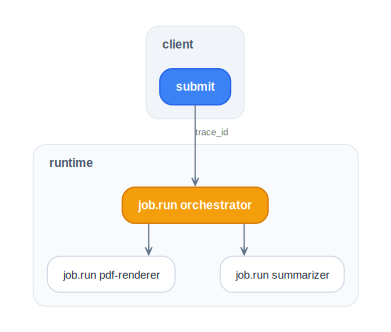

# Observability (§11)

ARCP carries W3C trace context end to end. With
[`@agentruntimecontrolprotocol/middleware-otel`](../packages/middleware-otel.md), every
envelope generates a span and every job becomes a unit of work in
your tracing backend.

## Trace propagation

Every envelope can carry a `trace_id` at the top level and a
`traceparent`/`tracestate` pair inside
`extensions["x-vendor.opentelemetry.tracecontext"]`. The OTel
middleware injects these on send and extracts them on receive — so
the runtime side starts a child span linked to the client's span.

```ts
// envelope on the wire:
{
  arcp: "1.1",
  id: "01J...",
  type: "job.submit",
  trace_id: "0123456789abcdef0123456789abcdef",
  payload: { agent: "echo", input: {} },
  extensions: {
    "x-vendor.opentelemetry.tracecontext": {
      traceparent: "00-0123...-...",
      tracestate: "vendor=value",
    },
  },
}
```

## Setup

```ts
import { withTracing } from "@agentruntimecontrolprotocol/middleware-otel";
import { trace } from "@opentelemetry/api";

const tracer = trace.getTracer("arcp-client", "1.0.0");

const transport = await WebSocketTransport.connect("wss://.../arcp");
const traced = withTracing(transport, { tracer });

await client.connect(traced);
```

Same on the runtime side:

```ts
const tracer = trace.getTracer("arcp-runtime", "1.0.0");

startWebSocketServer({
  onTransport: (t) => server.accept(withTracing(t, { tracer })),
});
```

## Span shape

The middleware emits two span types per envelope:

| Span                  | Attributes                                                                                       |
| --------------------- | ------------------------------------------------------------------------------------------------ |
| `arcp.send <type>`    | `arcp.direction`, `arcp.type`, `arcp.id`, `arcp.session_id`, `arcp.job_id?`, `arcp.event_seq?`   |
| `arcp.recv <type>`    | same                                                                                             |

For payloads that carry them, the middleware also attaches:
`arcp.agent`, `arcp.lease.capabilities` (comma-joined keys),
`arcp.lease.expires_at`, and `arcp.budget.remaining` (JSON-encoded
per-currency totals).

Customize span names via options. The defaults are
`` `arcp.send ${type}` `` and `` `arcp.recv ${type}` ``:

```ts
withTracing(transport, {
  tracer,
  sendSpanName: (frame) => `arcp.send.${(frame as { type?: string }).type ?? "unknown"}`,
  recvSpanName: (frame) => `arcp.recv.${(frame as { type?: string }).type ?? "unknown"}`,
});
```

## Per-job spans

A job is a useful boundary for application spans. Inside an agent:

```ts
server.registerAgent("report", async (input, ctx) => {
  // The current span context is set by the OTel middleware from the
  // incoming traceparent; child spans nest naturally.
  await tracer.startActiveSpan("collect-sources", async (span) => {
    span.setAttribute("source.count", input.sources.length);
    await collect(input.sources);
    span.end();
  });

  return { ok: true };
});
```

You don't have to thread the trace through manually — OTel context
follows async hops via `AsyncLocalStorage`, and the middleware sets
the context before invoking handlers.

## Delegation cascades

Children inherit the parent's `trace_id`, so delegate jobs become
child spans of the parent automatically:

<picture>
  <source media="(prefers-color-scheme: dark)" srcset="../../diagrams/observability-delegation-dark.svg">
  
</picture>

See [delegation.md](./delegation.md#trace-propagation).

## Without OTel

If you don't want OTel, you can still set `trace_id` manually on every
`submit`. Use any 32-hex generator — the runtime validates the format
via `isValidTraceId`:

```ts
import { randomBytes } from "node:crypto";
import type { TraceId } from "@agentruntimecontrolprotocol/core";

const traceId = randomBytes(16).toString("hex") as TraceId; // 32 hex
await client.submit({
  agent: "x",
  input: {},
  traceId,
});
```

`trace_id` is just a 32-hex string; the runtime propagates it to all
events under that job and to any children spawned via delegate. Use
it for log correlation even without distributed tracing.

## Heartbeats vs spans

The v1.1 heartbeat (§6.4) is for keep-alive, not observability. The
OTel middleware emits a span per frame unconditionally — including
`session.ping` and `session.pong`. If the heartbeat traffic is too
noisy, suppress it at the OTel pipeline (sampler / view) rather than
at the middleware: override `sendSpanName` / `recvSpanName` to fold
heartbeat spans onto a name your sampler drops, or wrap the inner
transport so heartbeats bypass the traced layer entirely.

## Per-session log binding

`@agentruntimecontrolprotocol/core`'s logger is `pino`-shaped.
`sessionLogger(parent, sessionId)` returns a child logger pre-bound
to `session_id`:

```ts
import { rootLogger, sessionLogger } from "@agentruntimecontrolprotocol/core";

const log = sessionLogger(rootLogger, ctx.sessionId);
log.info({ job_id: ctx.jobId }, "starting");
```

For Effect-aware code, `LoggerLayer` replaces Effect's default logger
with the pino-backed one, and `sessionLoggerEffect(sessionId,
effect)` runs `effect` with `session_id` annotated on every log
record produced inside its scope.

`ctx.logger` is pre-bound to `session_id` and `job_id`. Log entries
naturally correlate with traces if you emit `trace_id` as a field —
recommended pattern:

```ts
const log = ctx.logger.child({ trace_id: ctx.traceId });
log.info("starting work");
```

## Sampling

OTel sampling is your call — the middleware just emits spans into
whatever tracer you pass. For high-throughput runtimes, sample at the
collector rather than at the SDK to keep parent/child relationships
intact.

## Runnable example

[`examples/tracing/`](../../examples/tracing/) — full client + runtime
with OTel SDK wired up to a console exporter, including delegation.
