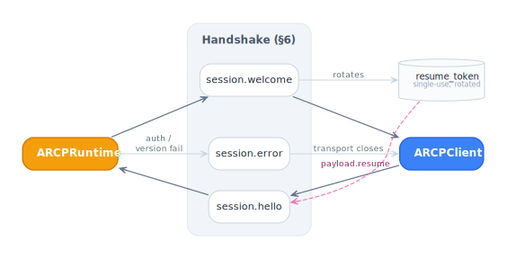

# Sessions (§6)

A session is a long-lived ARCP context over a single transport. It
starts with a three-message handshake and persists until either side
sends `session.bye` (or the transport drops).

<picture>
  <source media="(prefers-color-scheme: dark)" srcset="../../diagrams/session-handshake-dark.svg">
  
</picture>

## Handshake

```
C → R   session.hello   { client, auth, capabilities?, resume? }
R → C   session.welcome { runtime, capabilities, resume_token, resume_window_sec }
        — or —
R → C   session.error   { code, message }     (transport then closes)
```

Three things happen in `session.welcome`:

1. The runtime declares its identity (`runtime.name`, `runtime.version`).
2. Capabilities are **negotiated**, not echoed. The welcome's
   `capabilities.encodings` and `capabilities.agents` are the
   intersection of what the client requested and what the runtime
   advertises. v1.1 features negotiate the same way.
3. A fresh **resume token** is issued. It's single-use; every
   subsequent `session.welcome` (during resume) rotates it.

## Client side

```ts
import { ARCPClient, WebSocketTransport } from "@agentruntimecontrolprotocol/sdk";

const client = new ARCPClient({
  client: { name: "my-client", version: "1.0.0" },
  authScheme: "bearer",
  token: process.env.TOKEN,
  // optional v1.1 features the client wants enabled:
  features: ["heartbeat", "ack", "list_jobs", "subscribe"],
  handshakeTimeoutMs: 5000,
});

const transport = await WebSocketTransport.connect(
  "wss://runtime.example.com/arcp",
);
const welcome = await client.connect(transport);

console.log("runtime:", welcome.runtime.name);
console.log("features:", client.negotiatedFeatures);
console.log("resume_token:", welcome.resume_token);
```

The promise from `client.connect()` resolves to `SessionWelcomePayload`.
The assigned `session_id` lives on the envelope (and on the client as
`client.state.id`); the SDK fills it in for outbound traffic produced
by helpers like `submit`, `ack`, `listJobs`, and `subscribe`. When
calling `client.send(env)` directly you must stamp `session_id`
yourself.

## Runtime side

```ts
import {
  ARCPServer,
  StaticBearerVerifier,
  startWebSocketServer,
} from "@agentruntimecontrolprotocol/sdk";

const server = new ARCPServer({
  runtime: { name: "my-runtime", version: "1.0.0" },
  capabilities: { encodings: ["json"], agents: ["greet"] },
  bearer: new StaticBearerVerifier(new Map([["tok", { principal: "me" }]])),
  // optional tuning:
  resumeWindowSeconds: 600,
  heartbeatIntervalSeconds: 30,
  cancelGraceMs: 30_000,
});

await startWebSocketServer({
  host: "0.0.0.0",
  port: 7777,
  onTransport: (t) => server.accept(t),
});
```

`server.accept(transport)` returns a `SessionContext` representing the
new session. Most callers never touch it directly; the runtime drives
all per-session logic internally.

## Session state machine

Both the client and runtime track the same four `SessionPhase` values
(`packages/core/src/state/types.ts`):

```
opening
  ↓ send session.hello
  ↓ receive session.welcome
accepted     ←→  any normal message
  ↓ send/receive session.bye  OR  transport closes
closing
```

`session.error` from the runtime (or any pre-welcome rejection) puts
the session into `rejected` instead of `closing`. `accepted` is the
only phase from which traffic flows. The transport is closed by the
runtime as part of `session.error` emission (§6 mandates this).

## Closing cleanly

Either side can send `session.bye { reason? }`:

```ts
await client.close("done"); // sends session.bye then closes transport
```

The runtime's reciprocal:

```ts
await sessionCtx.send({ type: "session.bye", payload: { reason: "shutdown" } });
```

Past the `session.bye`, no more job-scoped envelopes may flow. The SDK
guards this — `client.send()` after close throws synchronously.

## Capability negotiation

The client advertises what it supports; the runtime returns the
intersection in the welcome. There's no renegotiation mid-session.

```ts
// client requests v1.1 features
features: ["heartbeat", "ack", "list_jobs", "subscribe", "agent_versions"];

// runtime advertises only some
features: ["heartbeat", "ack"];

// negotiated → ["heartbeat", "ack"]
client.hasFeature("subscribe"); // false
```

If a feature isn't negotiated, calls that depend on it throw
synchronously rather than emitting a non-conforming envelope.

## Per-session DoS caps

The runtime applies caps to protect against runaway sessions
(§14, configurable on `ARCPServerOptions.caps`):

| Cap                 | Default | Effect                                     |
| ------------------- | ------- | ------------------------------------------ |
| `maxBufferedEvents` | 10,000  | Resume buffer ceiling per session.         |
| `maxBufferedBytes`  | 16 MiB  | Resume buffer byte ceiling.                |
| `maxConcurrentJobs` | 100     | Live `pending`/`running` jobs per session. |

Exceeding any cap closes the session with `INTERNAL_ERROR`
(non-retryable).

## Heartbeat (v1.1, §6.4)

When the `heartbeat` feature negotiates, the runtime emits a
`session.ping { nonce, sent_at }` every `heartbeatIntervalSeconds` and
the peer answers with `session.pong { ping_nonce, received_at }`. The
welcome carries the negotiated interval in
`welcome.heartbeat_interval_sec`. Missing two consecutive pongs trips
`HeartbeatLostError` and closes the session.

The SDK handles both sides automatically when the feature is
enabled — you don't write any code for it. Pings and pongs are NOT
counted in `event_seq`.

## Back-pressure ack (v1.1, §6.5)

When `ack` is negotiated, the client periodically sends `session.ack {
last_processed_seq }`. The runtime emits a `back_pressure` `status`
event when unacked events cross `backPressureThreshold` (default
1000). Pass `autoAck: true` to the client to enable automatic acking:

```ts
const client = new ARCPClient({
  // ...
  autoAck: { intervalMs: 250, minSeqDelta: 32 },
});
```

Manual acks:

```ts
await client.ack(seq);
```

See [job-events.md](./job-events.md) for how back-pressure interacts
with event streaming.

## Resume

Sessions support resume — see [resume.md](./resume.md) for the
mechanics. Briefly: the runtime advertises `resume_token` and
`resume_window_sec` on every welcome; the client can present the
prior `session_id`, `resume_token`, and `last_event_seq` on a fresh
`session.hello` to recover within the window.
