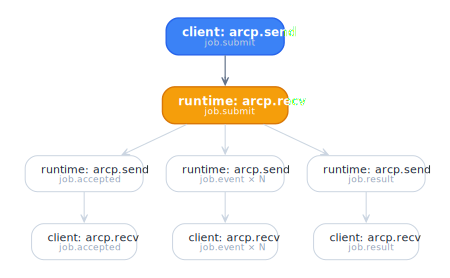

# @agentruntimecontrolprotocol/middleware-otel

OpenTelemetry middleware. Wraps any `Transport` to emit spans for
every frame and propagate W3C trace context end-to-end. Implements
ARCP §11 trace propagation.

## Install

```sh
pnpm add @agentruntimecontrolprotocol/middleware-otel @agentruntimecontrolprotocol/core @opentelemetry/api
```

You also need an OTel SDK setup (`@opentelemetry/sdk-node` or
`@opentelemetry/sdk-trace-web`) elsewhere — this package only emits
spans; it doesn't bootstrap exporters.

## Use

```ts
import { withTracing } from "@agentruntimecontrolprotocol/middleware-otel";
import { trace } from "@opentelemetry/api";

const tracer = trace.getTracer("arcp-client", "1.0.0");

// Wrap any transport:
const traced = withTracing(transport, { tracer });
await client.connect(traced);
```

Same pattern on the runtime side:

```ts
startWebSocketServer({
  onTransport: (t) => server.accept(withTracing(t, { tracer })),
});
```

## API

### `withTracing(inner, options): Transport`

| Option                             | Notes                                                                    |
| ---------------------------------- | ------------------------------------------------------------------------ |
| `tracer: Tracer`                   | OpenTelemetry `Tracer` instance.                                         |
| `sendSpanName?: (frame) => string` | Custom span name on send. Default: `` `arcp.send ${frame.type}` ``.      |
| `recvSpanName?: (frame) => string` | Custom span name on receive. Default: `` `arcp.recv ${frame.type}` ``.   |

Returns a new `Transport` that wraps `inner`. Calls
`inner.send`/`inner.onFrame` underneath; transparent to the rest of
the SDK. An Effect-shaped twin is also exported as `OtelTracerLayer`
+ `OtelTracerLayerOptions` for `ManagedRuntime`-based callers.

## What it does

### On send

1. Starts a `Span` named per `sendSpanName(frame)`.
2. Injects the active span's W3C trace context into
   `frame.extensions["x-vendor.opentelemetry.tracecontext"]`.
3. Sets attributes (`arcp.direction`, `arcp.type`, `arcp.id`,
   `arcp.session_id`, `arcp.job_id?`, `arcp.trace_id?`,
   `arcp.event_seq?`, plus payload-derived attributes when present:
   `arcp.agent`, `arcp.lease.capabilities` (comma-joined),
   `arcp.lease.expires_at`, `arcp.budget.remaining` (JSON-encoded)).
4. Calls `inner.send(frame)`.
5. Ends the span.

### On receive

1. Reads `traceparent`/`tracestate` from
   `frame.extensions["x-vendor.opentelemetry.tracecontext"]`.
2. Starts a `Span` named per `recvSpanName(frame)` as a child of the
   extracted context.
3. Sets the OTel context for downstream handlers via
   `context.with(ctx, handler)`.
4. Ends the span when the handler resolves.

This means handler code (inside agents, inside client `on(...)`
callbacks) runs with the correct OTel context active — child spans
nest correctly without manual threading.

## Heartbeats are not filtered

`withTracing` produces a span for every frame, including
`session.ping` and `session.pong`. The middleware does NOT skip
heartbeats — if their volume is a problem, drop them in the OTel
pipeline (sampler, view, or a tail-based processor) rather than at
the middleware. Alternatively, route heartbeats through an inner
transport that is NOT wrapped with `withTracing`; only the outer,
job-bearing traffic then produces spans.

## Composing with other transport wrappers

`withTracing` is a transport-in, transport-out function. You can
stack it:

```ts
const traced = withTracing(loggingWrapper(rateLimitWrapper(transport)), {
  tracer,
});
```

Order matters — tracing should usually be outermost so spans cover
the inner wrappers' work.

## Per-job span hierarchy

A typical span tree for a single job:

<picture>
  <source media="(prefers-color-scheme: dark)" srcset="../../diagrams/per-job-span-tree-dark.svg">
  
</picture>

Adding user-defined spans inside an agent (`tracer.startActiveSpan`)
nests under the `runtime: arcp.recv (job.submit)` span automatically.

## Delegation cascades

Children inherit the parent's `trace_id`, so a `delegate` event
becomes a child span of the parent job's `arcp.recv (job.submit)`
span. See [delegation guide](../guides/delegation.md).

## Source

[`packages/middleware/otel/src/`](../../packages/middleware/otel/src/).

## Runnable example

[`examples/tracing/`](../../examples/tracing/).
