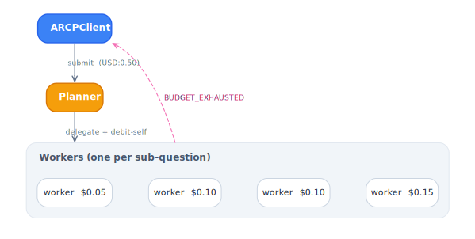
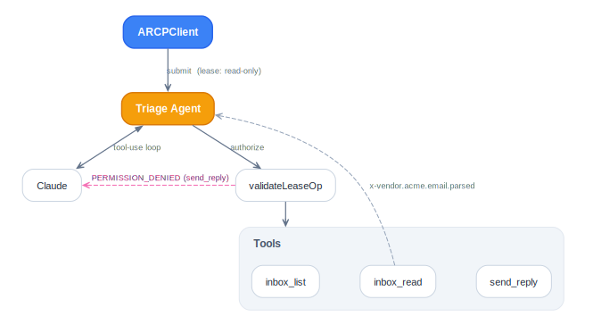
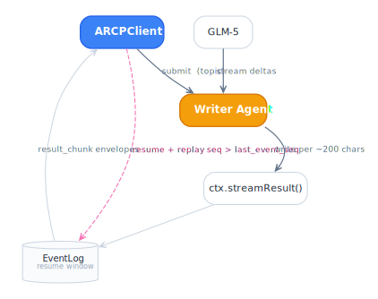
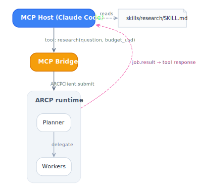

# Recipes

Composed ARCP features wired around a real LLM workload. Unlike the
single-feature [`examples/`](../examples/) — which use toy agents (echo,
timer, fake build) — each recipe is a complete end-to-end shape with an
actual provider SDK driving the agent.

## [multi-agent-budget/](multi-agent-budget/) — OpenAI

<picture>
  <source media="(prefers-color-scheme: dark)" srcset="diagrams/multi-agent-budget-dark.svg">
  
</picture>

The planner decomposes a question into sub-questions and delegates each
to a worker carrying a budget slice carved from its own remaining cap.
After each grant the planner emits a `cost.delegate` metric on itself so
the runtime's subset check at the next delegate sees an honest remaining
balance. Workers that overspend trip `BUDGET_EXHAUSTED`; sub-questions
that no longer fit are skipped before the delegate.

## [email-vendor-leases/](email-vendor-leases/) — Claude

<picture>
  <source media="(prefers-color-scheme: dark)" srcset="diagrams/email-vendor-leases-dark.svg">
  
</picture>

A triage agent runs Claude through a tool-use loop with three tools, but
the lease grants only the two read-only ones. When the model proposes
`send_reply` the agent's `validateLeaseOp` throws and feeds
`PERMISSION_DENIED` back to Claude, which observes the deny and returns
a drafted-but-unsent reply. Each `inbox_read` also emits an
`x-vendor.acme.email.parsed` event so dashboards recognising the
namespace can render parsed metadata specially.

## [litellm-credentials/](litellm-credentials/) — Provisioned Credentials

Maps ARCP `model.use`, `cost.budget`, and `lease_constraints.expires_at`
onto LiteLLM virtual key generation and revocation. This stays in
`recipes/` so provider-specific HTTP calls do not become core runtime
coupling.

## [stream-resume/](stream-resume/) — GLM-5

<picture>
  <source media="(prefers-color-scheme: dark)" srcset="diagrams/stream-resume-dark.svg">
  
</picture>

The writer pipes GLM-5's streaming deltas into `ctx.streamResult()`,
batching ~200 chars per `result_chunk` envelope. Every envelope lands in
the runtime's `EventLog` under a monotonic `event_seq`. The client drops
the transport mid-stream, opens a fresh one with `client.resume()`, and
the runtime replays every envelope past the cutoff so reassembly
completes seamlessly across the gap.

## [mcp-skill/](mcp-skill/) — MCP bridge

<picture>
  <source media="(prefers-color-scheme: dark)" srcset="diagrams/mcp-skill-dark.svg">
  
</picture>

An MCP server fronts the [multi-agent-budget](multi-agent-budget/)
planner so any MCP host (Claude Code, Cursor, Desktop) can call it as a
single `research` tool. The bridge keeps one long-lived ARCP session;
each MCP tool invocation submits a fresh planner job and returns the
terminal result as the tool's text response. A Claude Code skill at
[skills/research/SKILL.md](mcp-skill/skills/research/SKILL.md) tells the
model when to reach for the tool.

---

Diagram sources are in [`diagrams/`](diagrams/) along with the kit used
to keep the light/dark variants in sync.
